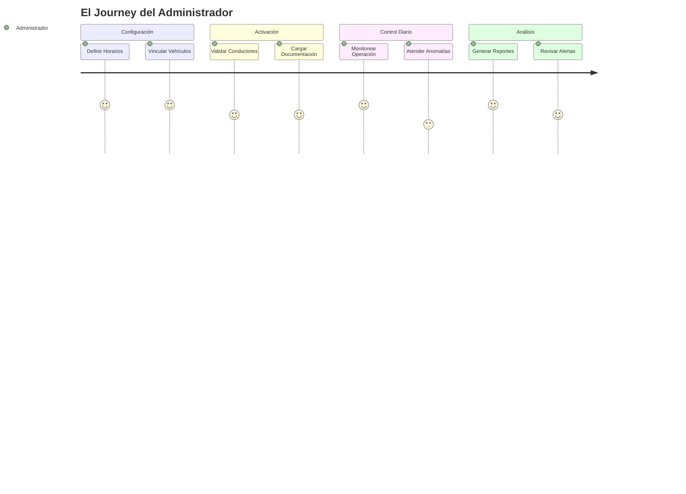
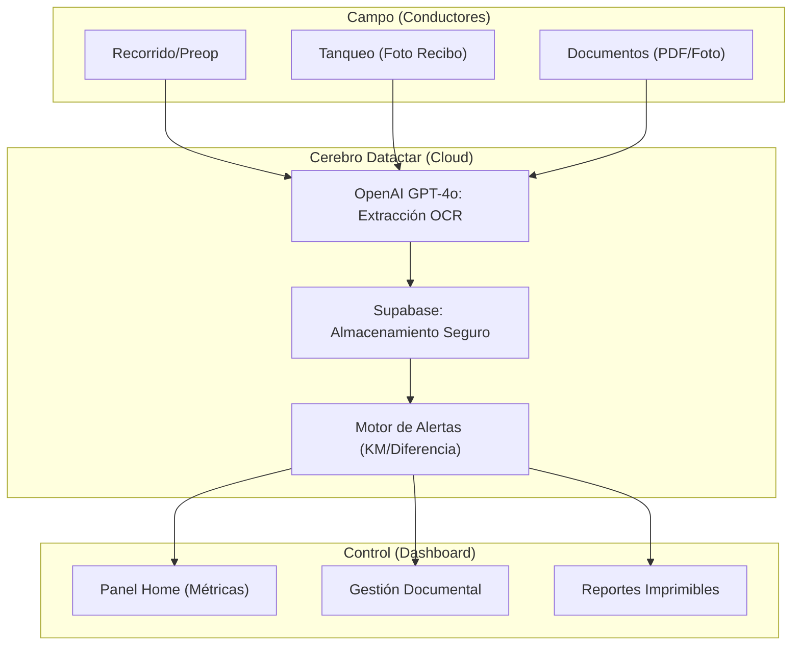
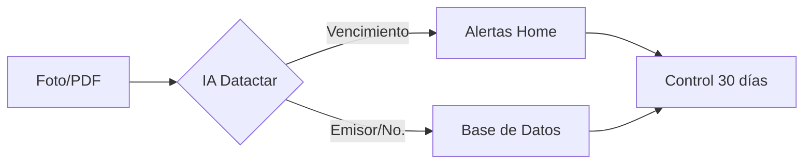

# 🛡️ Manual Maestro del Administrador - Datactar Decisions OS v2.0

Esta guía técnica y operativa detalla todas las funciones del sistema, diseñada para una gestión profesional de flota basada en datos y automatización.

---

## 🚀 1. El Journey del Administrador (Flujo Maestro)

El ciclo de vida de la administración en Datactar se resume en este esquema:

---

## 📈 2. Arquitectura de Datos y Sincronización

---

## 🖥️ 3. Desglose de Funciones por Módulo

### A. Panel de Control (Home)
Es el monitor en tiempo real de tu operación.
- **Rutas Activas**: Vehículos que han completado el preoperacional hoy.
- **Rutas Terminadas**: Vehículos que ya reportaron su KM final.
- **Anomalías**: Resumen de fallos y comentarios preventivos.
- **Operational Tracking**: Listado con semáforo de actividad. El icono 🔔 permite enviar una notificación directa al conductor si está omitiendo su reporte.

### B. Inventario de Vehículos (`/vehicles`)
- **Ficha Técnica**: Marca, Modelo, Placa y Estado.
- **Estados Maestro**: Activo (Operativo), Mantenimiento (Bloquea rutas), Inactivo (Fuera de flota).
- **Asignación de Conductor**: Sincronización directa entre la ficha y el bot.

### C. Conductores: Principal vs Adicionales
El sistema permite asignar múltiples conductores a un mismo vehículo:
- **Conductor Principal**: Se resalta en el perfil y es el referente principal del vehículo.
- **Conductores Adicionales**: Tienen el mismo poder de registro que el principal.
- **Escenario de Relevo**: El sistema permite que el **Conductor A** inicie el recorrido (haga el preoperacional) y el **Conductor B** lo finalice. Ambos registros quedarán vinculados a la placa y se verá quién hizo cada uno en el historial.

- **Detección Automática**: Los conductores se vinculan vía Telegram con `/vincular`.
- **Estado de Cuenta**: Puedes activar o desactivar conductores para restringir acceso al bot.

### D. Módulo de Documentos Inteligentes (`/documents`)

- **Extracción Automática**: El sistema lee SOAT, Tecno y Licencias.
- **Alertas Proactivas**: Aviso visual amarillo a los 30 días y rojo al vencimiento.

### E. Inteligencia de Reportes (`/reports`)
- **Consolidado KM**: Diferencia entre odómetros iniciales y finales.
- **Cumplimiento**: Cálculo automático de "Asistencia de Reporte" según el horario laboral.
- **Preoperacional**: Desglose pregunta por pregunta de la seguridad diaria.
- **Reporte Maestro**: Reporte individual con recomendaciones de la IA (Floti).

---

## 🔧 4. Parametrización y Alertas

### Centro de Alertas (`/alerts`)
- **Reglas de KM**: Configura alertas fijas (ej. cada 5,000 KM para aceite).
- **Resolución**: Marcar una alerta como "Resuelta" reinicia el ciclo de control.

### Ajustes Globales (`/settings`)
- **Horario Laboral**: Define días y horas de operación para que el cálculo de cumplimiento sea exacto.

---

## ❓ FAQ Técnica

> [!IMPORTANT]
> **¿Cómo se calcula el KM recorrido?**
> El sistema toma el odómetro final del día anterior y lo resta del final de hoy. Si no hay registro hoy, usa el último valor conocido.

> [!WARNING]
> **Seguridad de Datos**
> El sistema usa Row Level Security (RLS). Solo administradores autorizados pueden ver documentos y fotos privadas.
