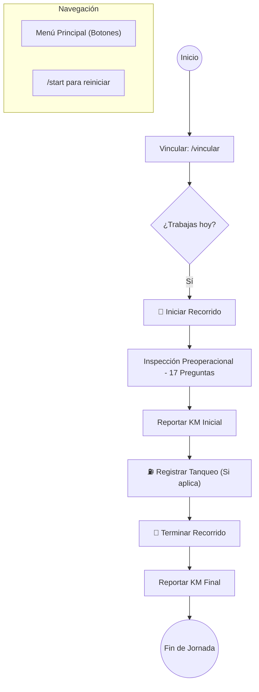
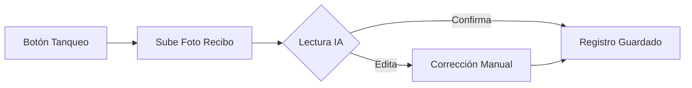

# 🚗 Guía del Conductor - Datactar Bot v2.0

Esta guía te explica cómo usar el bot de Telegram para reportar tus actividades de forma rápida y profesional.

---

## 🚀 1. El Journey del Conductor (Flujo Diario)

Este es el proceso que seguirás cada día para que tu gestión sea perfecta:



---

## ⚡ 2. Registro Inicial (Única vez)

Para que el sistema te reconozca, debes vincularte siguiendo este esquema:

```mermaid
sequenceDiagram
    participant Conductor
    participant Bot
    participant Administrador

    Conductor->>Bot: /vincular Nombre Apellido
    Bot-->>Conductor: "Esperando validación..."
    Administrador->>Bot: Activa al conductor
    Bot-->>Conductor: "✅ ¡Bienvenido! Menú disponible."

> [!NOTE]
> **Vehículos Compartidos**: Si compartes vehículo con otro compañero, ambos pueden estar asignados a la misma placa. Uno puede iniciar el turno y el otro terminarlo si es necesario.
```

---

## 📋 3. Funciones Paso a Paso

### A. Iniciar Recorrido (Inspección de Seguridad)
Al presionar **"🚀 Iniciar Recorrido"**, el bot te guiará en la inspección de 17 puntos críticos (Frenos, Luces, Llantas, etc.).
- **BIEN**: Todo está en orden.
- **MAL**: El bot te pedirá un comentario. Ej: "Llantas con baja presión". Esto genera una alerta inmediata al administrador.
- **KM Inicial**: Al terminar, escribe el kilometraje actual del tablero.

### B. Registrar Tanqueo

1.  Presiona **"⛽ Registrar Tanqueo"**.
2.  Sube una foto legible del recibo.
3.  La IA leerá los galones y el costo total. Tú solo debes confirmar y ¡listo!

### C. Terminar Recorrido
1.  Presiona **"🏁 Terminar Recorrido"**.
2.  Reporta el kilometraje final.
3.  El bot te dirá cuántos kilómetros recorriste y te llevará de vuelta al **Menú Principal**.

---

## ⚠️ 4. Consejos de Oro

- **¿Te perdiste?**: Siempre puedes escribir `/start` para que aparezca el menú de botones.
- **Baja Señal**: Si la foto del recibo no sube, intenta subirla como **"Documento"** en vez de **"Foto"**, o muévete a un punto con mejor conexión.
- **Comentarios Reales**: Tu seguridad es lo más importante. No dudes en reportar cualquier falla por pequeña que sea. El sistema está hecho para prevenir accidentes.

---

### 🛡️ Tu reporte es tu seguridad. ¡Buen viaje!
